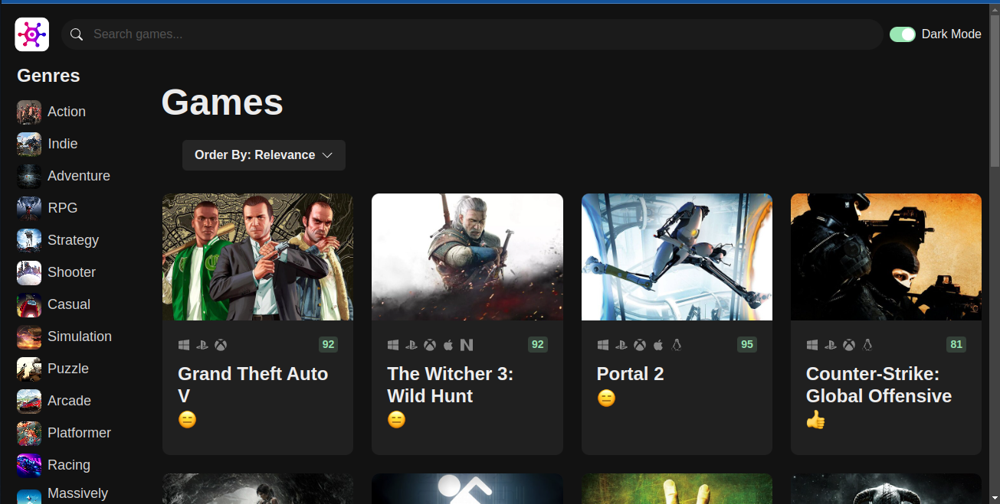

# game-hub

{:width="200px"}

This is a project that I built as part of the practice in the course React 18 for Beginners taught by Mosh Hamedani.

## Tecnologias utilizadas

## Tabla de Contenidos

- [Instalación](#instalación)
- [Uso](#uso)
- [Contribución](#contribución)
- [Licencia](#licencia)

## Instalación

Instrucciones paso a paso sobre cómo instalar tu proyecto. Por ejemplo:

```bash
git clone https://github.com/usuario/proyecto.git
cd proyecto
npm install
```
