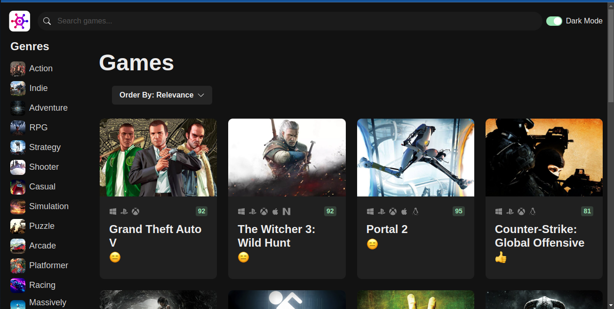
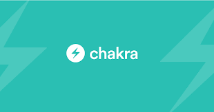

# game-hub

[Visita la app](https://game-hub-green-iota.vercel.app/)



This is a project that I built as part of the practice in the course React 18 for Beginners taught by Mosh Hamedani.

## Tecnologias utilizadas

<p align="center">
  
  
  
</p>

## API


https://rawg.io/

## Instalación

```bash
git clone https://github.com/grabielito/game-hub.git
cd proyecto
npm install
```

## Ejecución de manera local

```
npm run dev
```
